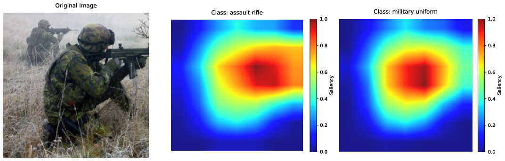
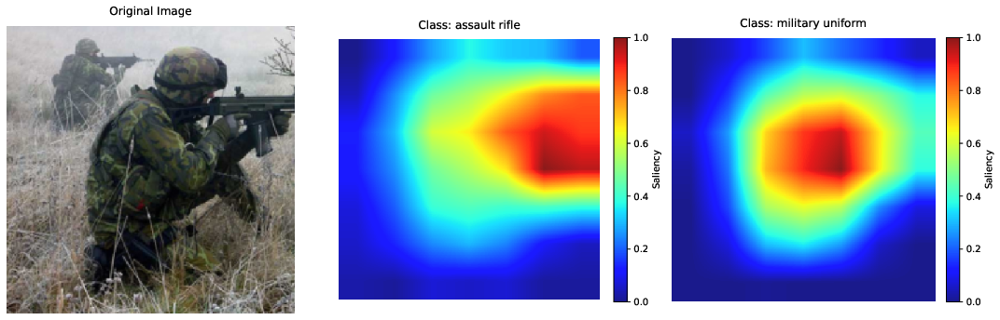

# CASE: Contrastive Activation for Saliency Estimation

[](https://arxiv.org/abs/2506.07327)
[](LICENSE)

> 📘 *“Saliency methods often appear visually plausible but can fail to distinguish between competing class predictions. CASE addresses this by isolating uniquely discriminative evidence for each class label.”*

This repository contains the full experimental pipeline for our paper:

> **CASE: Contrastive Activation for Saliency Estimation**
> Dane Williamson, Matthew Dwyer, Yangfeng Ji
> Springer Machine Learning (under review), preprint [arXiv:2506.07327v2](https://arxiv.org/abs/2506.07327)*

---

## 🔍 Overview

CASE introduces a **contrastive extension to Grad-CAM** that improves class sensitivity by subtracting attribution shared with frequently confused classes. We also propose a **diagnostic test** for class-specificity based on saliency agreement between top-1 and top-2 predictions.

This repo includes:

* ✔️ Our proposed diagnostic test for class sensitivity (RQ1)
* ✔️ A perturbation-based faithfulness evaluation (RQ2)
* ✔️ Full code to reproduce saliency maps, agreement scores, and statistical analysis
* ✔️ An ablation study on DenseNet revealing architecture-induced saliency separation

---

## 🔍 Example

<p align="center">
  
  
</p>

**Figure**: Saliency maps for different class labels on the same input using Grad-CAM vs. CASE. Grad-CAM highlights nearly identical regions regardless of class label, whereas CASE isolates distinct class-relevant evidence.

---


## 🧪 Reproducing Experiments

### 1. Setup Environment

```bash
python3 -m venv venv
source venv/bin/activate
pip install -r requirements.txt
```

Ensure ImageNet and CIFAR-100 data are available locally. Edit the paths in the bash scripts accordingly.

---

### 2. Run Experiments

#### ✅ RQ1: Class Sensitivity Diagnostic

```bash
bash scripts/run_rq1.sh resnet 5 500 70
```

* Tests top-k overlap between saliency maps for top-1 and top-2 predicted classes.
* Produces `agreement_eval.csv` and runs Wilcoxon signed-rank test.

#### ✅ RQ2: Explanation Fidelity (Confidence Drop)

```bash
bash scripts/run_rq2.sh resnet 50 500 1
```

* Measures the drop in predicted confidence after ablating top-k salient regions.
* Outputs plots and test results in `.rqtwo/`.

#### ✅ Ablation: DenseNet Seed Robustness

```bash
bash scripts/run_rq1_densenet_ablation.sh densenet 70 5
```

* Retrains DenseNet on CIFAR-100 with 5 random seeds.
* Evaluates stability of class-specific saliency under different initializations.

---

## 📂 Repository Structure

```
CASE/
│   ├── CAM_eval/
│   │   ├── class_sensitive.py
│   │   └── comprehensive_eval.py
│   ├── plots/
│   │   ├── rq_one_analysis.py
│   │   └── analysis.py
│   |└── ablation/
│   |    ├── train_model.py
│   |    └── agreement_finetuned.py
|   └── load_datasets/
|       │   └─── imagenet_classes.txt
│       └── cifar100_labels.txt
├── data/                         # Local dataset paths (user-supplied)
├── results/                      # Figures, CSVs, and plots (generated)
├── requirements.txt              # environment file
└── README.md
```

---

## 📊 Key Results

| Method    | Class Sensitivity (↓ overlap) | Confidence Drop (↑ fidelity) |
| --------- | ----------------------------- | ---------------------------- |
| Grad-CAM  | ✗ Often identical maps        | Moderate                     |
| Score-CAM | ✗ Varies by architecture      | High                         |
| **CASE**  | ✅ Consistently distinct       | High                         |

CASE achieves **robust class separation** while maintaining fidelity, even on architectures where other methods fail.

---

## 🧠 Citation

If you use this work, please cite our paper:

```bibtex
@article{williamson2025case,
  title={CASE: Contrastive Activation for Saliency Estimation},
  author={Williamson, Dane and Dwyer, Matthew and Ji, Yangfeng},
  journal={arXiv preprint arXiv:2506.07327},
  year={2025}
}
```

## ✉️ Contact

For questions or collaborations, please contact:

* Dane Williamson: `dw3zn@virginia.edu`
